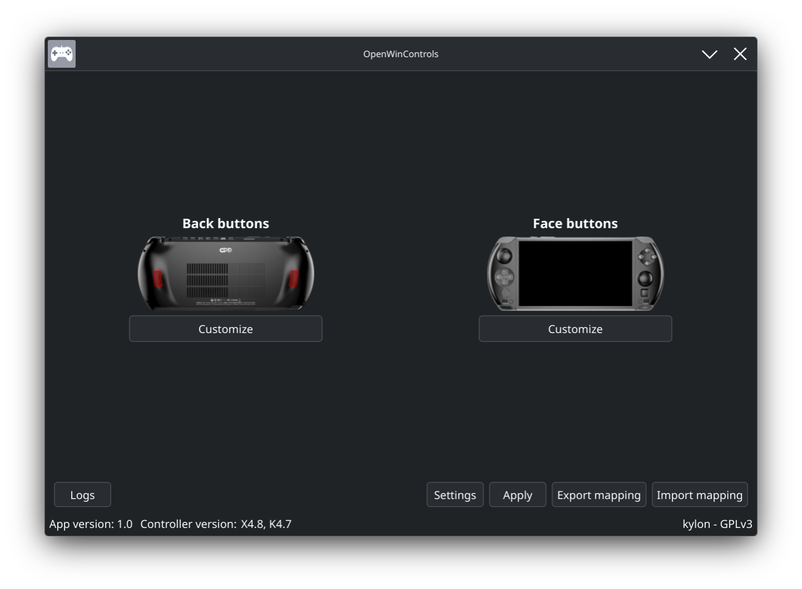
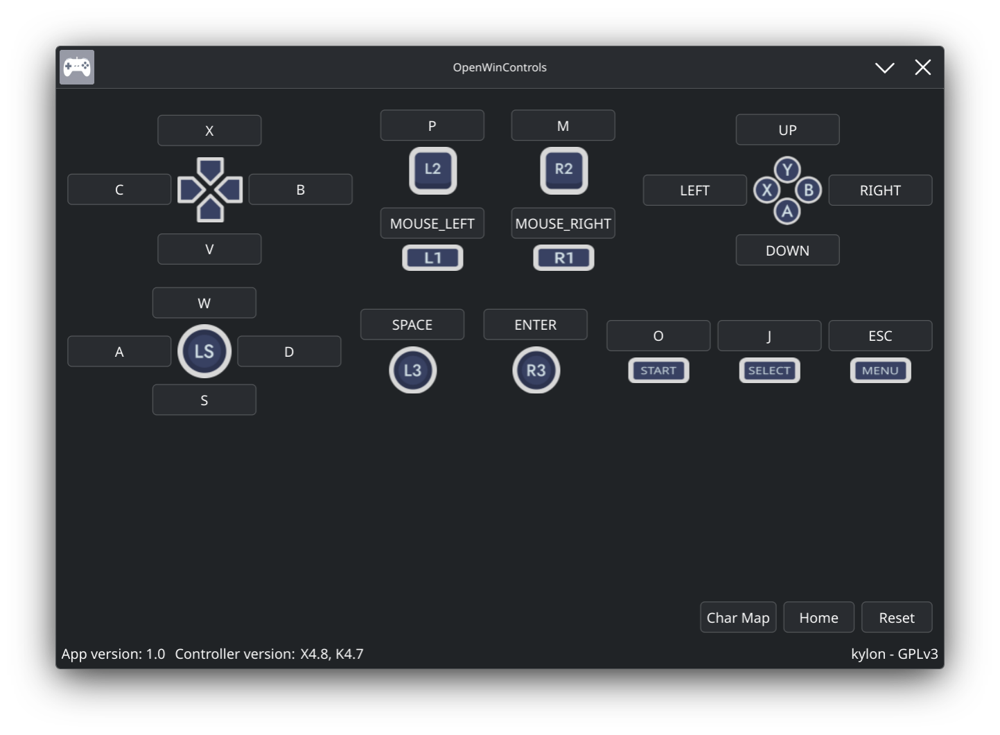

# OpenWinControls

Multiplatform GPD WinControls replacement

## Features

- Import and export mappings from/to yaml files
- Remap all buttons (in all modes , keyboard/xinput, where supported)
- Deadzone, shoulder leds (win4) and vibration intensity settings
- Built-in char map

## Linux

Root permissions are required.

To run without root, allow access to the controller:

Create the file **70-gpd-controller.rules** in **/etc/udev/rules.d**

```text
SUBSYSTEMS=="usb", ATTRS{idVendor}=="2f24", ATTRS{idProduct}=="0135", TAG+="uaccess"
SUBSYSTEMS=="usb", ATTRS{idVendor}=="2f24", ATTRS{idProduct}=="0137", TAG+="uaccess"
```

Load the new rules:

```bash
sudo udevadm control --reload-rules && sudo udevadm trigger
```

## Usage

Select a button you want to remap, either input the key from your keyboard,
or use the built-in char map.

**Controller V2 macros**

Chain multiple keys by assigning an incremental start time and a fixed hold time to each slot.

To simulate a single key press, set one key slot, start time to 0
and hold time to something high like **300**.

## How to build

```bash
git clone --recursive https://github.com/OpenWinControls/OpenWinControls
git submodule update --init --recursive
cmake -B build
make -C build
```

## Credits

button icons - https://github.com/RobTheFiveNine/flat-gamepad-icons

---




