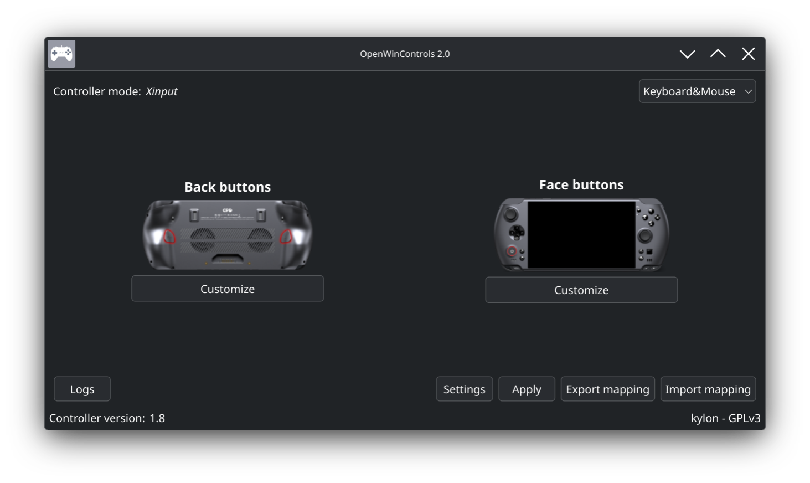
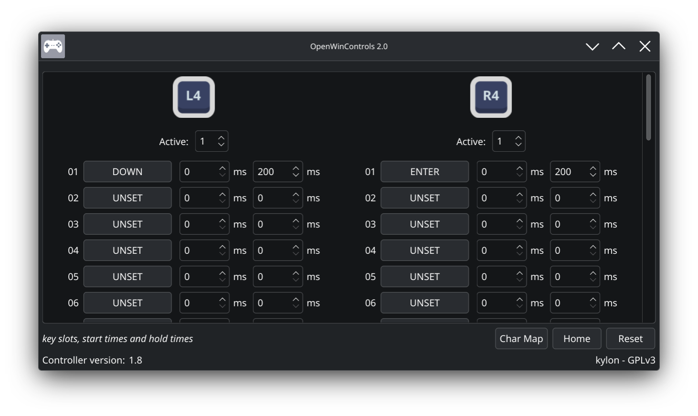
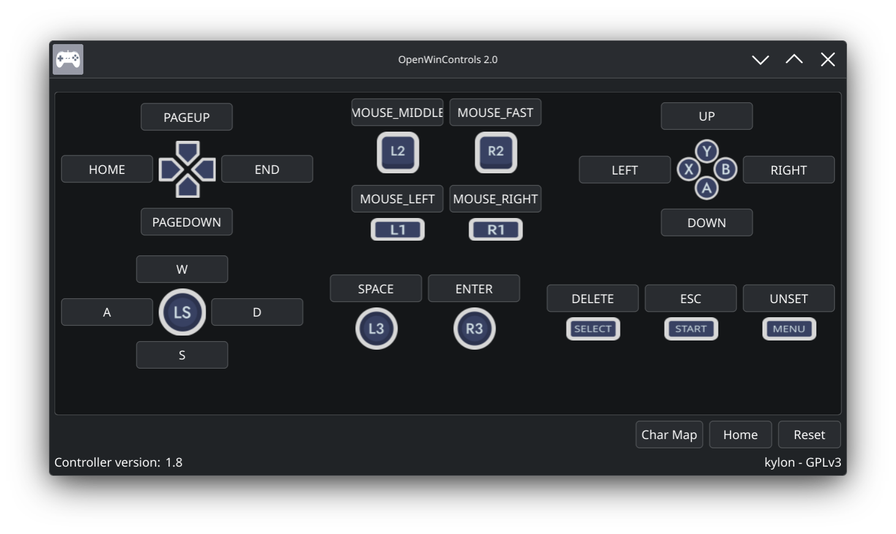
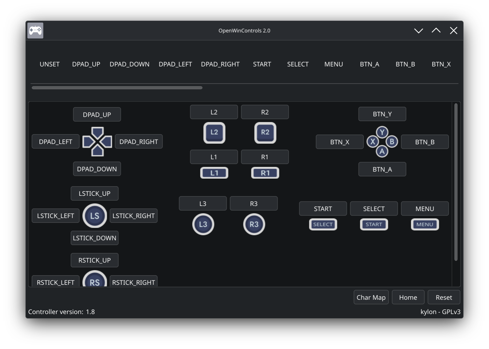

# OpenWinControls

Multiplatform GPD WinControls replacement

## Features

- Allows to remap **all** controller buttons
- Allows to set all back button macro slots
- Allows to remap controller buttons in xinput mode (xbox 360 controller) (_if supported_)
- Deadzone, shoulder leds (win4) and vibration intensity settings
- Built-in char map with all supported keycodes
- Import/Export mappings from/to yaml files
- Import/Download mappings from the [community repo](https://github.com/OpenWinControls/CommunityProfiles)
- Try to restore the controller to a known working state, if corrupted by other software (_Restore button in settings_)

## Requirements

OpenWinControls expect your device to be running the latest controller firmware,
if the app is not recognizing your controller, please make sure you are running latest firmware,
and if not, download it from GPD site.

## Known device firmware bugs (must be fixed by GPD)

### All

- Mouse codes (left/right/middle click, fast cursor), when assigned to **back buttons**,
don't work until controller mode is switched once to mouse mode, after boot.
You can switch back to gamepad after that, but be aware that they may still not work as expected.
Controller V2 seems to have more issues when mouse codes are assigned to them, compared to V1.
[**This is very very unlikely to be fixed!**]

### V2 devices

- RT and LT ignore the keycode value in firmware config [_**still waiting for a fix.., notified gpd febrary 2026**_]

## Linux

Root permissions are required.

To run without root, allow access to the controller:

Create the file **70-gpd-controller.rules** in **/etc/udev/rules.d**

```text
SUBSYSTEMS=="usb", ATTRS{idVendor}=="2f24", ATTRS{idProduct}=="0135", TAG+="uaccess"
SUBSYSTEMS=="usb", ATTRS{idVendor}=="2f24", ATTRS{idProduct}=="0137", TAG+="uaccess"
```

Load the new rules:

```bash
sudo udevadm control --reload-rules && sudo udevadm trigger
```

## Usage

Select a button you want to remap, either input the key from your keyboard, or use the built-in char map.

## Controller V2 macro functions

Chain up to 32 keys to create macros or key shortcuts. (_**firmware is buggy and badly coded, play with timings**_)

### Simulate single button click

```
Active slot count: 1

Slot 01: [your key here], 0 ms, 200 ms
```

### Simulate key shortcut

```
Active slot count: [number of keys in your shortcut]

Slot 01: [your key here], 100 ms, 100 ms  
Slot 02: [your key here], 100 ms, 100 ms  
[..more]
```

## How to build

```bash
git clone --recursive https://github.com/OpenWinControls/OpenWinControls
git submodule update --init --recursive
cmake -B build
make -C build
```

## Credits

button icons - https://github.com/RobTheFiveNine/flat-gamepad-icons

---









_from win 5_
